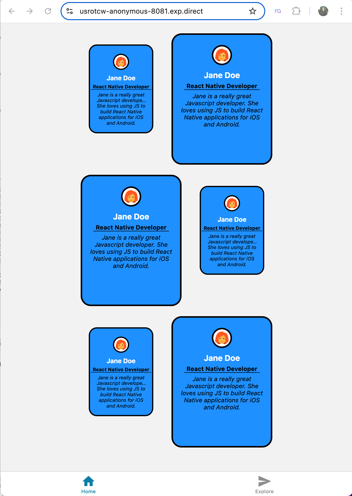

# PE04
Create a React Native mobile app building a Profile Card component based on the [_React Native Action by Dabit, N. and Buckner, N._](https://learning.oreilly.com/library/view/react-native-in/9781617294051/c03.xhtml#h1-294051c03-0005) (Chapter 5) - Styling In Depth). 

This project has two parts:

**Part 1:**
Create a Profile Card that contains: user image, name, title and job descripton.

User image can be download at [Icon8](https://icons8.com/icons/set/user).

**Part 2:**
Now take the completed Profile Card from Part 1, complete the following user requirements:

**User Requirements:**
1. Create a six Profile Card thumbnails, two cards per row (total of 3 rows).
2. Each Card Profile must display: user image, name, title and job description.
3. When clicked on the thumbnail, the Card Profile will expand. 
4. Use Flexbox layout tool and Transformation property to scale the Card Profile.

**System Requirements:**
- Performing class components.
- You must use the core components at least once – View, Text, ScrollView, Image, TextInput, StyleSheet, TouchableHighlight, FlatList, Platform, etc. 

## input-process-output model:
1. A requirement from the environment (input)
2. A computation based on the requirement (process)
3. A provision for the environment (output)

### 1. Input
Runs the app in the development mode after creating a Mobile app

Open [http://localhost:8081](http://localhost:8081) to view it in your browser.

### 2. Process
1. Create a Github repo
2. Select the _"code"_ button from the tab and from the dropdown menu select Codespaces to create codespace on main.

3. In the terminal run to create the mobile app:
```
npx create-expo-app YourMobileAppName
```
4. CD into the newly created UourMobileAppName directory from the terminal.
5. Connect your Expo credentials run:
```
npx expo login
```
Note: enter your username and password

#### Optional
To reset project script to start from scratch run:

```
npm run reset-project
```

6. Add your code. Once satisfied. To start up your app, run:
```
npm run web
```
OR
```
npx expo start --tunnel
```

Note: Uses a **_tunnel_** connection (via Expo servers), allowing your mobile device to connect even if it’s on a different Wi-Fi or cellular network.

If it asks to install @expo/ngrok@^4.1.0, type **_"y"_** for yes.

6. Open [http://localhost:8081](http://localhost:8081) to view it in your browser, scan the QR code or manually type the exp://usrotcw-anonymous-8081.exp.direct/ url onto your mobile device.


Note: 
- To view the mobile app on your device you need to install **_Expo Go_** onto your phone first to be able to use the following feature. 

- To view the app on the browser type **_"w"_** on your terminal. 

- To view the app on a mobile device scan the QR code or manually type the given exp link.

- To refresh the app, type **_"r"_** in the terminal. 

7. To exit the application run,
```
control + c
```

### 3. Output

***1. Part 1 Profile Card Output***


***2. Part 2 - Profile Card Thumbnails***


***3. Part 2 - Profile Card Expanded***




### 4. Additional Resources

[TouchableHighlight](https://reactnative.dev/docs/touchablehighlight)

[Platform](https://reactnative.dev/docs/platform)

[Flatlist](https://reactnative.dev/docs/flatlist)

[Immutability-Helper](https://www.npmjs.com/package/immutability-helper/v/2.2.2) (Optional)

[Expo's Doc](https://docs.expo.dev/tutorial/create-your-first-app/)

[Create your first mobile app](https://docs.expo.dev/tutorial/create-your-first-app/)

************************

# Additional Information


# Welcome to your Expo app 👋

This is an [Expo](https://expo.dev) project created with [`create-expo-app`](https://www.npmjs.com/package/create-expo-app).

## Get started

1. Install dependencies

   ```bash
   npm install
   ```

2. Start the app

   ```bash
    npx expo start
   ```

In the output, you'll find options to open the app in a

- [development build](https://docs.expo.dev/develop/development-builds/introduction/)
- [Android emulator](https://docs.expo.dev/workflow/android-studio-emulator/)
- [iOS simulator](https://docs.expo.dev/workflow/ios-simulator/)
- [Expo Go](https://expo.dev/go), a limited sandbox for trying out app development with Expo

You can start developing by editing the files inside the **app** directory. This project uses [file-based routing](https://docs.expo.dev/router/introduction).

## Get a fresh project

When you're ready, run:

```bash
npm run reset-project
```

This command will move the starter code to the **app-example** directory and create a blank **app** directory where you can start developing.

## Learn more

To learn more about developing your project with Expo, look at the following resources:

- [Expo documentation](https://docs.expo.dev/): Learn fundamentals, or go into advanced topics with our [guides](https://docs.expo.dev/guides).
- [Learn Expo tutorial](https://docs.expo.dev/tutorial/introduction/): Follow a step-by-step tutorial where you'll create a project that runs on Android, iOS, and the web.

## Join the community

Join our community of developers creating universal apps.

- [Expo on GitHub](https://github.com/expo/expo): View our open source platform and contribute.
- [Discord community](https://chat.expo.dev): Chat with Expo users and ask questions.
