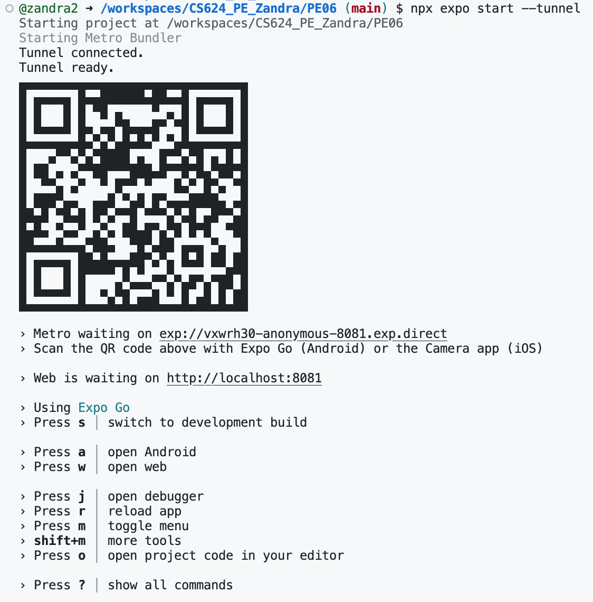
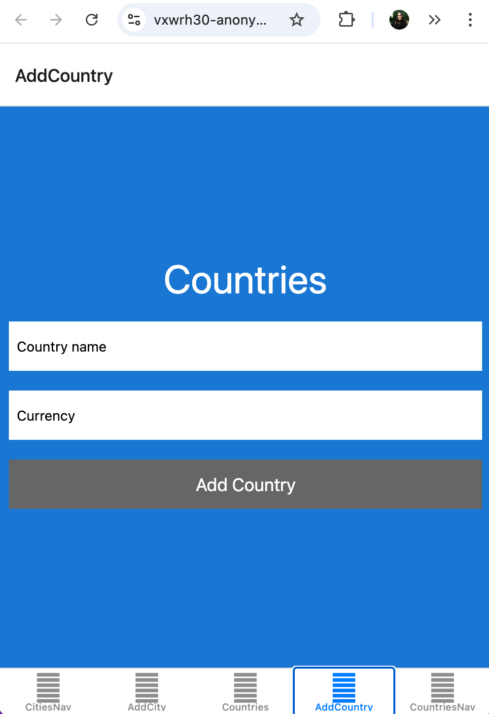
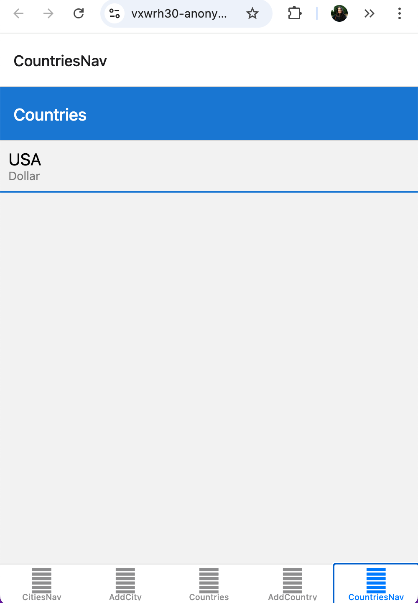
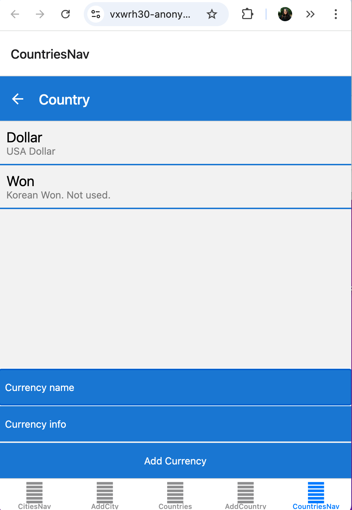

# PE06
**User Requirements:**
1. In this week’s HOS, you have learned how to create Stack Navigator and add Screens to the “CitiesNav” tab. You are expected to enhance PE05 by adding stack-based navigators to the “CountriesNav” tab.
2. In the “CountriesNav” tab, you will show the countries list and their currencies used or not used in the country. 
3. Like Cities and City, you will show a stack-based navigation between Countries and Country.
4. All styles are customized for Countries, Country, and Currency.

Addtional Note: 
1. You can refer to Chapter 6 Navigation from the textbook “React Native in Action,” to understand tab and stack-based navigation.
2. The textbook must be used for reference only. Some APIs are outdated and might have nonfunctional code. 
3. Use your HOS08 and PE05 to finish this exercise successfully.

Personal Note:
I DO NOT have a full understanding of the CountriesNav's functionality. I completed the task to my best knowledge of the assignment's requirement based on the context and the shared screenshots. 

**System Requirements:**
- Bottom Tab Navigator
- React Native Screens
- React Native uuid
- You must use the core components at least once – View, Text, ScrollView, Image, TextInput, StyleSheet, TouchableHighlight, FlatList, Platform, NavigationContainer, createBottomTabNavigator, createNativeStackNavigator, LogBox, etc. 

## input-process-output model:
1. A requirement from the environment (input)
2. A computation based on the requirement (process)
3. A provision for the environment (output)

### 1. Input
Runs the app in the development mode after creating a Mobile app

Open [http://localhost:8081](http://localhost:8081) to view it in your browser.

### 2. Process
1. Create a Github repo
2. Select the _"code"_ button from the tab and from the dropdown menu select Codespaces to create codespace on main.

3. In the terminal run to create the mobile app:
```
npx create-expo-app YourMobileAppName
```
4. CD into the newly created YourMobileAppName directory from the terminal.
5. Install the following:
```
npm install @react-navigation/native
```
```
npx expo install react-native-screens react-native-safe-area-contex
```
```
npm install @react-navigation/bottom-tabs
```
```
npm install @react-navigation/native-stack
```
```
npm install react-native-uuid --save
```
6. Go to _package.json_ and replace main to:
**"main": "node_modules/expo/AppEntry.js",**

7. Connect your Expo credentials run (optional):
```
npx expo login
```
Note: enter your username and password

#### Optional
To reset project script to start from scratch run:

```
npm run reset-project
```

8. Add your code. Once satisfied. To start up your app, run:
```
npm run web
```
OR
```
npx expo start --tunnel
```

Note: Uses a **_tunnel_** connection (via Expo servers), allowing your mobile device to connect even if it’s on a different Wi-Fi or cellular network.

If it asks to install @expo/ngrok@^4.1.0, type **_"y"_** for yes.

9. Open [http://localhost:8081](http://localhost:8081) to view it in your browser, scan the QR code or manually type the exp://vxwrh30-anonymous-8081.exp.direct/ url onto your mobile device.




Note: 
- To view the mobile app on your device you need to install **_Expo Go_** onto your phone first to be able to use the following feature. 

- To view the app on the browser type **_"w"_** on your terminal. 

- To view the app on a mobile device scan the QR code or manually type the given exp link.

- To refresh the app, type **_"r"_** in the terminal. 

10. To exit the application run,
```
control + c
```

### 3. Output

***1. Inital Screen with all tabs***


***2. Add Country Tab***



***3. Countries Stack***



***4. Countries Tab***




### 4. Additional Resources

[Navigation](https://medium.com/@chathurangacpm/combining-stack-navigation-and-tab-navigation-in-react-native-a-step-by-step-guide-1346cf96ccd9)

[Navigation Lifecycle](https://reactnavigation.org/docs/navigation-lifecycle/)

[Navigating Between Screens](https://reactnative.dev/docs/navigation)

[TouchableHighlight](https://reactnative.dev/docs/touchablehighlight)

[Platform](https://reactnative.dev/docs/platform)

[Expo's Doc](https://docs.expo.dev/tutorial/create-your-first-app/)

[Create your first mobile app](https://docs.expo.dev/tutorial/create-your-first-app/)

************************

# Additional Information


# Welcome to your Expo app 👋

This is an [Expo](https://expo.dev) project created with [`create-expo-app`](https://www.npmjs.com/package/create-expo-app).

## Get started

1. Install dependencies

   ```bash
   npm install
   ```

2. Start the app

   ```bash
    npx expo start
   ```

In the output, you'll find options to open the app in a

- [development build](https://docs.expo.dev/develop/development-builds/introduction/)
- [Android emulator](https://docs.expo.dev/workflow/android-studio-emulator/)
- [iOS simulator](https://docs.expo.dev/workflow/ios-simulator/)
- [Expo Go](https://expo.dev/go), a limited sandbox for trying out app development with Expo

You can start developing by editing the files inside the **app** directory. This project uses [file-based routing](https://docs.expo.dev/router/introduction).

## Get a fresh project

When you're ready, run:

```bash
npm run reset-project
```

This command will move the starter code to the **app-example** directory and create a blank **app** directory where you can start developing.

## Learn more

To learn more about developing your project with Expo, look at the following resources:

- [Expo documentation](https://docs.expo.dev/): Learn fundamentals, or go into advanced topics with our [guides](https://docs.expo.dev/guides).
- [Learn Expo tutorial](https://docs.expo.dev/tutorial/introduction/): Follow a step-by-step tutorial where you'll create a project that runs on Android, iOS, and the web.

## Join the community

Join our community of developers creating universal apps.

- [Expo on GitHub](https://github.com/expo/expo): View our open source platform and contribute.
- [Discord community](https://chat.expo.dev): Chat with Expo users and ask questions.